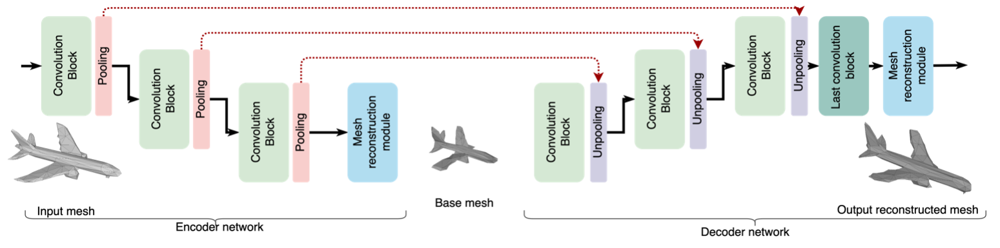

# MeshConv3D

Implementation of the MeshConv3D architecture for mesh autoencoders descirbed in our paper<br>
"*A 3D Mesh Convolution-Based Autoencoder for Geometry Compression*" (https://ieeexplore.ieee.org/abstract/document/11084738)
The entire framework is illustrated below.



## Data Preparation
The dataset to train the autoencoder should be prepared as follows:
### For training
1. Download the datasets at:
    - For SHREC: https://www.dropbox.com/s/w16st84r6wc57u7/shrec_16.tar.gz
    - For Manifold40: https://cg.cs.tsinghua.edu.cn/dataset/subdivnet/datasets/Manifold40-MAPS-96-3.zip
2. Put them in a folder following this structure:
    - SHREC
        -shrec (original dataset folder)
3. Launch the training, the code will automatically create a subfolder in ./SHREC where it will create the .npz it will use for the training of the networks

## Dependencies
```
   pytorch
   trimesh
   numpy
```

## To Run
1. Open the training scripts and modify the end of the file according to your local variables
2. Launch the training script

## Citation
Please cite our paper if you use this code in your own work:

```
@INPROCEEDINGS{11084738,
  author={Bregeon, Germain and Preda, Marius and Ispas, Radu and Zaharia, Titus},
  booktitle={2025 IEEE International Conference on Image Processing (ICIP)}, 
  title={A 3D Mesh Convolution-Based Autoencoder for Geometry Compression}, 
  year={2025},
  volume={},
  number={},
  pages={2199-2204},
  keywords={Geometry;Image coding;Three-dimensional displays;Image resolution;Autoencoders;Feature extraction;Image restoration;Decoding;Image reconstruction;Faces;Mesh autoencoder;mesh geometry compression;mesh convolution;mesh reconstruction},
  doi={10.1109/ICIP55913.2025.11084738}}
```
